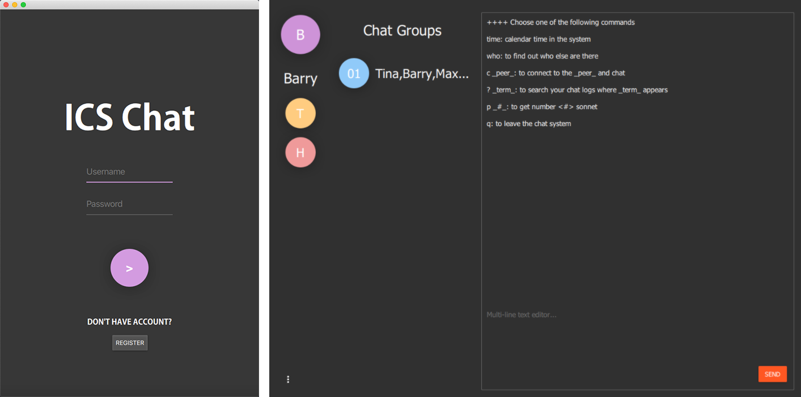

# pychat
A PyQt5 + socket chat application for Intro to Computer Science Fall 2019.

## Features
* Peer-to-peer & group chat.
* GUI Interface based on PyQt5 and QML.
* RSA Encryption.

## Dependencies
`
pip install PyQt5 PyQtCharts pycryptodome
`

## To Start
### Server
`
python ./pychat/cmat_server.py
`
### Client
`
python ./pychat/login.py
`
## Project Structure
Some files are ellipsed here for clear view.
```
root
├─ encrypt --- RSA Key/Pem
├─ images  --- image resources
├─ pychat
│    ├─ chat_server.py  --- server starter
│    ├─ login.py        --- client starter
└─ qml     --- QML Interfaces
```

## Demos

